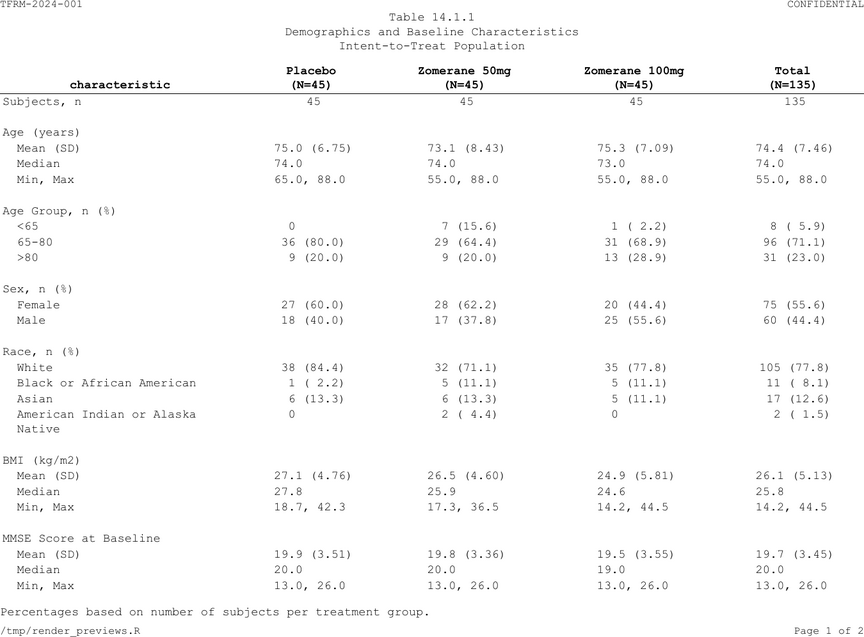
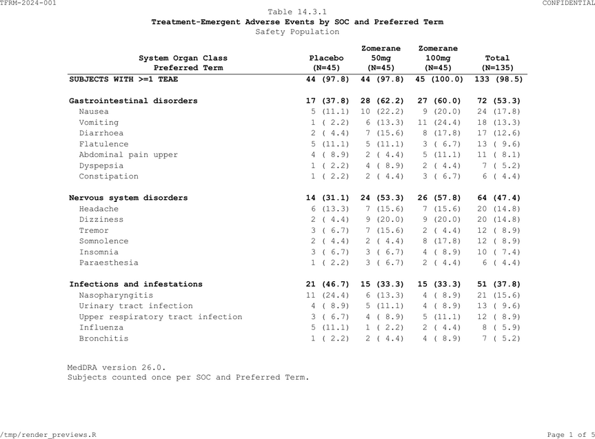

# Table Cookbook

Production table programs for study TFRM-2024-001 using built-in
datasets. Every table follows ICH E3 numbering.

## Study setup

Real programs don’t repeat settings in every table. Define shared
formatting **once** at the top of your study program (or in
`_tlframe.yml`):

``` r
# ── Study-wide theme (set once, inherited by all tables) ──
fr_theme(
  font_size   = 9,
  font_family = "Courier New",
  orientation = "landscape",
  hlines      = "header",
  header      = list(bold = TRUE, align = "center"),
  n_format    = "{label}\n(N={n})",
  footnote_separator = FALSE,
  pagehead    = list(left = "TFRM-2024-001", right = "CONFIDENTIAL"),
  pagefoot    = list(left = "{program}",
                     right = "Page {thepage} of {total_pages}")
)
```

Every table below inherits these settings automatically. Individual
tables only specify what is **unique** to them: data, titles, columns,
footnotes, and table-specific row logic.

> **Principle:** If you’re writing the same verb in two tables, it
> belongs in the theme or a recipe — not in the table program.

## N-counts

Define N-counts once per population. Reuse the same vector in every
table that shares that population:

``` r
# ── Population N-counts (reusable across tables) ──
n_itt    <- c(placebo = 45, zom_50mg = 45, zom_100mg = 45, total = 135)
n_safety <- c(placebo = 45, zom_50mg = 45, zom_100mg = 45, total = 135)
```

## 14.1.1 Demographics

``` r
demog_spec <- tbl_demog |>
  fr_table() |>
  fr_titles(
    "Table 14.1.1",
    "Demographics and Baseline Characteristics",
    "Intent-to-Treat Population"
  ) |>
  fr_cols(
    .width = "fit",
    characteristic = fr_col("", width = 2.5),
    placebo        = fr_col("Placebo", align = "decimal"),
    zom_50mg       = fr_col("Zomerane 50mg", align = "decimal"),
    zom_100mg      = fr_col("Zomerane 100mg", align = "decimal"),
    total          = fr_col("Total", align = "decimal"),
    group          = fr_col(visible = FALSE),
    .n = n_itt
  ) |>
  fr_rows(group_by = "group", blank_after = "group") |>
  fr_footnotes(
    "Percentages based on number of subjects per treatment group.",
    "MMSE = Mini-Mental State Examination."
  )
fr_validate(demog_spec)
```

Note what is **not** here:
[`fr_header()`](https://vthanik.github.io/tlframe/reference/fr_header.md),
[`fr_hlines()`](https://vthanik.github.io/tlframe/reference/fr_hlines.md),
[`fr_pagehead()`](https://vthanik.github.io/tlframe/reference/fr_pagehead.md),
[`fr_pagefoot()`](https://vthanik.github.io/tlframe/reference/fr_pagefoot.md),
`.n_format`, `.separator` — all inherited from the theme.

``` r
demog_spec |> fr_render("output/Table_14_1_1.rtf")
```



Demographics table (PDF output)

## 14.1.2 Demographics with `group_label`

When group variable names and statistic values are in separate columns,
`group_label` auto-injects group headers into the display column:

``` r
# ── Sample data: long-form demographics ──
demog_long <- data.frame(
  variable = c(
    "Sex", "Sex",
    "Age (years)", "Age (years)", "Age (years)", "Age (years)",
    "Race", "Race", "Race"
  ),
  statistic = c(
    "Female", "Male",
    "Mean (SD)", "Median", "Min, Max", "n",
    "White", "Black or African American", "Asian"
  ),
  placebo = c(
    "18 (40.0)", "27 (60.0)",
    "67.8 (6.9)", "68.0", "52, 84", "45",
    "38 (84.4)", "5 (11.1)", "2 (4.4)"
  ),
  zom_50mg = c(
    "21 (46.7)", "24 (53.3)",
    "68.2 (7.1)", "69.0", "54, 82", "45",
    "36 (80.0)", "6 (13.3)", "3 (6.7)"
  ),
  zom_100mg = c(
    "20 (44.4)", "25 (55.6)",
    "68.0 (7.3)", "67.0", "53, 83", "45",
    "37 (82.2)", "4 (8.9)", "4 (8.9)"
  ),
  stringsAsFactors = FALSE
)

demog_gl_spec <- demog_long |>
  fr_table() |>
  fr_titles(
    "Table 14.1.2",
    "Demographics by Category (Long-Form Layout)",
    "Intent-to-Treat Population"
  ) |>
  fr_cols(
    .width = "fit",
    variable  = fr_col(visible = FALSE),
    statistic = fr_col("", width = 2.5),
    placebo   = fr_col("Placebo", align = "decimal"),
    zom_50mg  = fr_col("Zomerane 50mg", align = "decimal"),
    zom_100mg = fr_col("Zomerane 100mg", align = "decimal"),
    .n = c(placebo = 45, zom_50mg = 45, zom_100mg = 45)
  ) |>
  fr_rows(
    group_by    = "variable",
    group_label = "statistic",
    indent_by   = "statistic"
  ) |>
  fr_footnotes("Percentages based on N per treatment arm.")
fr_validate(demog_gl_spec)
```

`group_label = "statistic"` injects `"Sex"`, `"Age (years)"`, and
`"Race"` as header rows in the statistic column. `indent_by` indents the
detail rows underneath. Style the headers via
[`fr_styles()`](https://vthanik.github.io/tlframe/reference/fr_styles.md)
if you want bold.

## 14.1.4 Subject Disposition

``` r
disp_spec <- tbl_disp |>
  fr_table() |>
  fr_titles(
    "Table 14.1.4",
    list("Subject Disposition", bold = TRUE),
    "All Randomized Subjects"
  ) |>
  fr_cols(
    category  = fr_col("", width = 2.5),
    placebo   = fr_col("Placebo", align = "decimal"),
    zom_50mg  = fr_col("Zomerane 50mg", align = "decimal"),
    zom_100mg = fr_col("Zomerane 100mg", align = "decimal"),
    total     = fr_col("Total", align = "decimal"),
    .n = n_itt
  ) |>
  fr_footnotes("Percentages based on number of subjects randomized per arm.")
fr_validate(disp_spec)
```

## 14.3.1 AE by SOC/PT

Multi-page table with continuation text, SOC/PT indentation, and
content-based row styling:

``` r
ae_soc_spec <- tbl_ae_soc |>
  fr_table() |>
  fr_titles(
    "Table 14.3.1",
    list("Treatment-Emergent Adverse Events by SOC and Preferred Term",
         bold = TRUE),
    "Safety Population"
  ) |>
  fr_page(continuation = "(continued)") |>
  fr_cols(
    soc       = fr_col(visible = FALSE),
    pt        = fr_col("System Organ Class\n  Preferred Term", width = 3.5),
    row_type  = fr_col(visible = FALSE),
    placebo   = fr_col("Placebo", align = "decimal"),
    zom_50mg  = fr_col("Zomerane\n50mg", align = "decimal"),
    zom_100mg = fr_col("Zomerane\n100mg", align = "decimal"),
    total     = fr_col("Total", align = "decimal"),
    .n = n_safety
  ) |>
  fr_rows(group_by = "soc", indent_by = "pt") |>
  fr_styles(
    fr_row_style(
      rows = fr_rows_matches("row_type", value = "total"), bold = TRUE),
    fr_row_style(
      rows = fr_rows_matches("row_type", value = "soc"), bold = TRUE)
  ) |>
  fr_footnotes(
    "MedDRA version 26.0.",
    "Subjects counted once per SOC and Preferred Term.",
    "Sorted by descending total incidence."
  )
fr_validate(ae_soc_spec)
```

Only `fr_page(continuation = "(continued)")` is added here because
continuation text is specific to this multi-page table.



AE by SOC/PT table (PDF output, page 1)

## 14.3.2 AE by SOC / HLT / PT (Three-Level Hierarchy)

Multi-level `indent_by` with a key column that drives indent depth:

``` r
# ── Sample data: three-level AE hierarchy ──
ae_3level <- data.frame(
  soc = c(
    rep("Gastrointestinal disorders", 5),
    rep("Nervous system disorders", 4)
  ),
  term = c(
    "Gastrointestinal disorders", "GI signs and symptoms",
    "Nausea", "Vomiting", "Diarrhoea",
    "Nervous system disorders", "Headaches",
    "Headache", "Migraine"
  ),
  row_type = c(
    "soc", "hlt", "pt", "pt", "pt",
    "soc", "hlt", "pt", "pt"
  ),
  placebo = c(
    "28 (62.2)", "20 (44.4)", "12 (26.7)", "5 (11.1)", "3 (6.7)",
    "18 (40.0)", "14 (31.1)", "10 (22.2)", "4 (8.9)"
  ),
  zom_100mg = c(
    "32 (71.1)", "24 (53.3)", "14 (31.1)", "6 (13.3)", "4 (8.9)",
    "22 (48.9)", "16 (35.6)", "12 (26.7)", "4 (8.9)"
  ),
  stringsAsFactors = FALSE
)

ae_3level_spec <- ae_3level |>
  fr_table() |>
  fr_titles(
    "Table 14.3.2",
    "TEAEs by SOC, HLT, and Preferred Term",
    "Safety Population"
  ) |>
  fr_cols(
    soc      = fr_col(visible = FALSE),
    row_type = fr_col(visible = FALSE),
    term     = fr_col("SOC / HLT / Preferred Term", width = 3.5),
    placebo  = fr_col("Placebo\n(N=45)", align = "decimal"),
    zom_100mg = fr_col("Zomerane 100mg\n(N=45)", align = "decimal")
  ) |>
  fr_rows(
    group_by  = "soc",
    indent_by = list(
      key    = "row_type",
      col    = "term",
      levels = c(soc = 0, hlt = 1, pt = 2)
    )
  ) |>
  fr_styles(
    fr_row_style(
      rows = fr_rows_matches("row_type", value = "soc"), bold = TRUE
    )
  ) |>
  fr_footnotes(
    "MedDRA version 26.0.",
    "Subjects counted once per SOC, HLT, and Preferred Term."
  )
fr_validate(ae_3level_spec)
#> Warning: ! 1 validation issue found:
#> • `indent_by` column not found in data: c(soc = 0, hlt = 1, pt = 2).
```

The `levels` vector maps `row_type` values to indent depth: SOC = 0
(flush left), HLT = 1 level, PT = 2 levels.

## 14.2.1 Time-to-Event

``` r
tte_spec <- tbl_tte |>
  fr_table() |>
  fr_titles(
    "Table 14.2.1",
    list("Time to Study Withdrawal", bold = TRUE),
    "Intent-to-Treat Population"
  ) |>
  fr_cols(
    section   = fr_col(visible = FALSE),
    statistic = fr_col("", width = 3.5),
    zom_50mg  = fr_col("Zomerane\n50mg", align = "decimal"),
    zom_100mg = fr_col("Zomerane\n100mg", align = "decimal"),
    placebo   = fr_col("Placebo", align = "decimal"),
    .n = c(zom_50mg = 45, zom_100mg = 45, placebo = 45)
  ) |>
  fr_rows(group_by = "section", blank_after = "section") |>
  fr_styles(
    fr_row_style(
      rows = fr_rows_matches("statistic", pattern = "^[A-Z]"),
      bold = TRUE
    )
  ) |>
  fr_footnotes(
    "[a] Kaplan-Meier estimate with Greenwood 95% CI.",
    "[b] Two-sided log-rank test stratified by age group.",
    "[c] Cox proportional hazards model.",
    "NE = Not Estimable."
  )
fr_validate(tte_spec)
```

`.n` uses a local vector here because the column order differs from
other tables (treatment arms exclude `total`).

## 14.4.1 Concomitant Medications

``` r
cm_spec <- tbl_cm |>
  fr_table() |>
  fr_titles(
    "Table 14.4.1",
    list("Concomitant Medications by Category and Agent", bold = TRUE),
    "Safety Population"
  ) |>
  fr_cols(
    category   = fr_col(visible = FALSE),
    medication = fr_col("Medication Category / Agent", width = 3.0),
    row_type   = fr_col(visible = FALSE),
    placebo    = fr_col("Placebo", align = "decimal"),
    zom_50mg   = fr_col("Zomerane\n50mg", align = "decimal"),
    zom_100mg  = fr_col("Zomerane\n100mg", align = "decimal"),
    total      = fr_col("Total", align = "decimal"),
    .n = n_safety
  ) |>
  fr_rows(group_by = "category", indent_by = "medication") |>
  fr_styles(
    fr_row_style(
      rows = fr_rows_matches("row_type", value = "total"), bold = TRUE),
    fr_row_style(
      rows = fr_rows_matches("row_type", value = "category"), bold = TRUE)
  ) |>
  fr_footnotes("Subjects counted once per category and medication.")
fr_validate(cm_spec)
```

## 14.3.6 Vital Signs with `page_by`

Multi-parameter table with spanning headers and per-page N-counts:

``` r
# Pre-compute per-parameter N-counts from ADVS
vs_n <- aggregate(
  USUBJID ~ PARAM + TRTA, data = advs[advs$AVISIT == "Baseline", ],
  FUN = function(x) length(unique(x))
)

vs_spec <- tbl_vs[tbl_vs$timepoint == "Week 24", ] |>
  fr_table() |>
  fr_titles(
    "Table 14.3.6",
    "Vital Signs --- Week 24 Summary",
    "Safety Population"
  ) |>
  fr_cols(
    param     = fr_col(visible = FALSE),
    timepoint = fr_col(visible = FALSE),
    statistic         = fr_col("Statistic", width = 1.2),
    placebo_base      = fr_col("Baseline"),
    placebo_value     = fr_col("Value"),
    placebo_chg       = fr_col("CFB"),
    zom_50mg_base     = fr_col("Baseline"),
    zom_50mg_value    = fr_col("Value"),
    zom_50mg_chg      = fr_col("CFB"),
    zom_100mg_base    = fr_col("Baseline"),
    zom_100mg_value   = fr_col("Value"),
    zom_100mg_chg     = fr_col("CFB"),
    .n = vs_n
  ) |>
  fr_rows(page_by = "param") |>
  fr_spans(
    "Placebo"        = c("placebo_base", "placebo_value", "placebo_chg"),
    "Zomerane 50mg"  = c("zom_50mg_base", "zom_50mg_value", "zom_50mg_chg"),
    "Zomerane 100mg" = c("zom_100mg_base", "zom_100mg_value", "zom_100mg_chg")
  ) |>
  fr_footnotes("CFB = Change from Baseline.")
fr_validate(vs_spec)
#> Warning: ! 1 validation issue found:
#> • Column widths (10.88in) exceed 110% of printable area (9in). Consider
#>   `fr_cols(.split = TRUE)` or narrower widths.
```

`.n` takes a 3-column data frame (parameter + treatment + count) for
automatic per-page N-counts when combined with `page_by`.

## Wide table with column split

When columns exceed the page width, `.split = TRUE` creates panels:

``` r
wide_spec <- tbl_vs[tbl_vs$timepoint == "Week 24" &
                     tbl_vs$param == "Systolic BP (mmHg)", ] |>
  fr_table() |>
  fr_titles("Table 14.3.6", "Systolic BP --- Column Split") |>
  fr_cols(
    param     = fr_col(visible = FALSE),
    timepoint = fr_col(visible = FALSE),
    statistic = fr_col("Statistic", width = 1.2, stub = TRUE),
    placebo_base      = fr_col("Placebo\nBaseline", width = 1.0),
    placebo_value     = fr_col("Placebo\nValue", width = 1.0),
    placebo_chg       = fr_col("Placebo\nCFB", width = 1.0),
    zom_50mg_base     = fr_col("Zom 50mg\nBaseline", width = 1.0),
    zom_50mg_value    = fr_col("Zom 50mg\nValue", width = 1.0),
    zom_50mg_chg      = fr_col("Zom 50mg\nCFB", width = 1.0),
    zom_100mg_base    = fr_col("Zom 100mg\nBaseline", width = 1.0),
    zom_100mg_value   = fr_col("Zom 100mg\nValue", width = 1.0),
    zom_100mg_chg     = fr_col("Zom 100mg\nCFB", width = 1.0),
    .split = TRUE, .width = "fit"
  )
fr_validate(wide_spec)
```

## What each layer owns

| Setting | Where it belongs | Why |
|----|----|----|
| Font, orientation, margins | [`fr_theme()`](https://vthanik.github.io/tlframe/reference/fr_theme.md) or `_tlframe.yml` | Same for every table |
| Header bold/center, `.n_format` | [`fr_theme()`](https://vthanik.github.io/tlframe/reference/fr_theme.md) or `_tlframe.yml` | Same for every table |
| `fr_hlines("header")` | [`fr_theme()`](https://vthanik.github.io/tlframe/reference/fr_theme.md) or `_tlframe.yml` | Same for every table |
| Page headers/footers | [`fr_theme()`](https://vthanik.github.io/tlframe/reference/fr_theme.md) or `_tlframe.yml` | Same for every table |
| `footnote_separator = FALSE` | [`fr_theme()`](https://vthanik.github.io/tlframe/reference/fr_theme.md) or `_tlframe.yml` | Same for every table |
| N-count vectors | Named variables (`n_itt`, `n_safety`) | Reused across tables |
| Titles, footnotes | Per-table | Unique to each table |
| Column definitions | Per-table | Unique to each table |
| Row logic (`group_by`, `indent_by`) | Per-table | Unique to each table |
| Row styles | Per-table | Unique to each table |
| `continuation`, `page_by` | Per-table | Only some tables need them |
