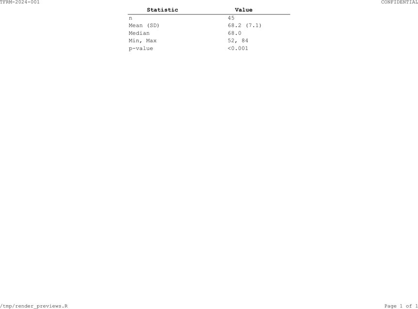
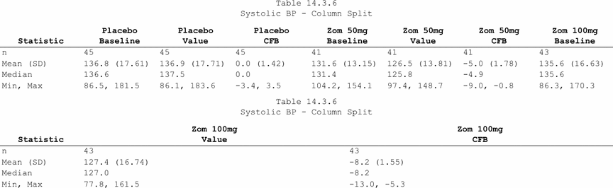

```{r setup, include = FALSE}
knitr::opts_chunk$set(collapse = TRUE, comment = "#>")
library(tlframe)
```

`fr_cols()` defines what columns look like. `fr_header()` styles the header
row. Together they control labels, widths, alignment, N-counts, and header
presentation.

## Defining columns

Each named argument to `fr_cols()` is an `fr_col()` spec:

```{r cols-basic}
spec <- tbl_demog |>
  fr_table() |>
  fr_cols(
    characteristic = fr_col("Characteristic", width = 2.5),
    placebo        = fr_col("Placebo", align = "right"),
    zom_50mg       = fr_col("Zomerane 50mg", align = "right"),
    zom_100mg      = fr_col("Zomerane 100mg", align = "right"),
    total          = fr_col("Total", align = "right"),
    group          = fr_col(visible = FALSE)
  )
names(fr_get_columns(spec))
```

Columns you don't mention get auto-generated defaults. Set `visible = FALSE`
to keep a column for logic (grouping, indentation) without rendering it.

### `fr_col()` parameters

| Parameter | Default | Description |
|-----------|---------|-------------|
| `label` | `""` (falls back to column name) | Display header text |
| `width` | `NULL` | Inches, `"auto"`, `"25%"`, or `NULL` (inherits `.width`) |
| `align` | `NULL` | `"left"`, `"right"`, `"center"`, `"decimal"`, or `NULL` (auto-detect) |
| `header_align` | `NULL` | Header cell alignment override (inherits `align`) |
| `visible` | `NULL` | `FALSE` hides from output; `NULL` = system decides |
| `stub` | `FALSE` | Repeats in every col_split panel |
| `n` | `NULL` | Per-column N-count (overrides `.n`) |
| `spaces` | `NULL` | `"indent"` or `"preserve"` for leading spaces |
| `group` | `NULL` | Spanning header group name (auto-creates a span via `fr_spans()`) |

> **SAS:** `DEFINE col / DISPLAY "Label" STYLE(column)=[width=2.5in just=right];`

## Width modes

The `.width` argument to `fr_cols()` controls the global width strategy:

```{r width-modes, eval = FALSE}
fr_cols(.width = NULL, ...)     # Same as "auto": estimate from content using font metrics
fr_cols(.width = "auto", ...)   # Estimate from content using font metrics
fr_cols(.width = "fit", ...)    # Auto + scale to fill the page
fr_cols(.width = "equal", ...)  # Divide page equally among unfixed columns
```

Percentage widths work per-column:

```{r width-pct}
spec <- data.frame(a = 1) |>
  fr_table() |>
  fr_cols(a = fr_col("Alpha", width = "25%"))
fr_get_col(spec, "a")$width
```

For most pharma tables, `"fit"` or explicit inch widths work best.

## Decimal alignment

Clinical tables display mixed statistics in the same column. `align = "decimal"`
auto-detects the stat type and aligns decimal points:

```{r decimal}
decimal_data <- data.frame(
  stat  = c("n", "Mean (SD)", "Median", "Min, Max", "p-value"),
  value = c("45", "68.2 (7.1)", "68.0", "52, 84", "<0.001"),
  stringsAsFactors = FALSE
)
spec <- decimal_data |>
  fr_table() |>
  fr_cols(
    stat  = fr_col("Statistic", width = 1.5),
    value = fr_col("Value", width = 2.0, align = "decimal")
  )
```

```{r decimal-preview, echo = FALSE, out.width = "100%", fig.cap = "Decimal-aligned mixed statistics (counts, means, ranges, p-values)"}

```

The engine recognises counts, floats, n (%), n/N (%), estimates with spreads,
CIs, range pairs, p-values, and missing values.

## Tidyselect formula syntax

Instead of naming every column individually, you can use a formula
`selector ~ fr_col(...)` to apply the same spec to multiple columns at once.
The left-hand side is any tidyselect expression; the right-hand side is the
`fr_col()` to apply:

```{r cols-formula}
spec <- tbl_demog |>
  fr_table() |>
  fr_cols(
    characteristic = fr_col("Characteristic", width = 2.5),
    starts_with("zom") ~ fr_col(width = 1.5, align = "right"),
    placebo = fr_col("Placebo", width = 1.5, align = "right"),
    total   = fr_col("Total",   width = 1.5, align = "right"),
    group   = fr_col(visible = FALSE)
  )
names(fr_get_columns(spec))
```

Formulas and named arguments can be mixed freely in the same call. Named
arguments take precedence over formulas when the same column is matched by
both.

## Hidden columns and label functions

```{r label-fn}
spec <- tbl_demog |>
  fr_table() |>
  fr_cols(
    .label_fn = function(x) gsub("_", " ", tools::toTitleCase(x)),
    group = fr_col(visible = FALSE)
  )
fr_get_columns(spec)$characteristic$label
```

## `fr_col(group=)` — auto-span shorthand

Setting `group = "label"` on an `fr_col()` is a compact alternative to
calling `fr_spans()` separately. Columns that share the same `group` string
are automatically grouped under a spanning header with that label:

```{r cols-group}
spec <- tbl_demog |>
  fr_table() |>
  fr_cols(
    characteristic = fr_col("Characteristic", width = 2.5),
    zom_50mg       = fr_col("50 mg",  width = 1.5, align = "right", group = "Zomerane"),
    zom_100mg      = fr_col("100 mg", width = 1.5, align = "right", group = "Zomerane"),
    placebo        = fr_col("Placebo", width = 1.5, align = "right"),
    total          = fr_col("Total",   width = 1.5, align = "right"),
    group          = fr_col(visible = FALSE)
  )
```

This is equivalent to adding `fr_spans("Zomerane" = c("zom_50mg", "zom_100mg"))`
after `fr_cols()`. You can still supply `.n` and `.n_format` at the same time
--- `group` names are matched by the N-count auto-routing logic, so the N
appears on the span:

```{r cols-group-n}
spec <- tbl_demog |>
  fr_table() |>
  fr_cols(
    characteristic = fr_col("Characteristic", width = 2.5),
    zom_50mg       = fr_col("50 mg",  width = 1.5, align = "right", group = "Zomerane"),
    zom_100mg      = fr_col("100 mg", width = 1.5, align = "right", group = "Zomerane"),
    placebo        = fr_col("Placebo", width = 1.5, align = "right"),
    total          = fr_col("Total",   width = 1.5, align = "right"),
    group          = fr_col(visible = FALSE),
    .n = c(Zomerane = 90, placebo = 45, total = 135),
    .n_format = "{label}\n(N={n})"
  ) |>
  fr_header(bold = TRUE, align = "center")
```

> Use `group=` when you are already naming every column in `fr_cols()` and
> want to avoid a separate `fr_spans()` call. Use `fr_spans()` directly when
> you prefer tidyselect column selection, multi-level spans, or fine-grained
> control over `.hline` and `.gap`.

## Header styling

`fr_header()` controls header presentation --- bold, alignment, colors, font
size. It does **not** handle N-counts (those go on `fr_cols()`).

```{r header-style}
spec <- tbl_demog |>
  fr_table() |>
  fr_cols(
    characteristic = fr_col("", width = 2.5),
    placebo   = fr_col("Placebo"),
    zom_50mg  = fr_col("Zomerane 50mg"),
    zom_100mg = fr_col("Zomerane 100mg"),
    total     = fr_col("Total"),
    group     = fr_col(visible = FALSE)
  ) |>
  fr_header(bold = TRUE, align = "center")
```

`fr_header()` parameters: `align`, `valign` (`"top"` / `"middle"` /
`"bottom"`), `bold`, `bg`, `fg`, `font_size`, `repeat_on_page` (default
`TRUE` --- set `FALSE` to print the header only on the first page).

### Tidyselect alignment

Target different columns with different alignments:

```{r header-tidy}
spec <- tbl_demog |>
  fr_table() |>
  fr_cols(
    characteristic = fr_col("", width = 2.5),
    placebo   = fr_col("Placebo"),
    zom_50mg  = fr_col("Zomerane 50mg"),
    zom_100mg = fr_col("Zomerane 100mg"),
    total     = fr_col("Total"),
    group     = fr_col(visible = FALSE)
  ) |>
  fr_header(bold = TRUE, align = list(
    left   = "characteristic",
    center = c(starts_with("zom"), "placebo", "total")
  ))
```

> **SAS:** `STYLE(header)=[just=center font_weight=bold];`

## N-counts

N-counts go on `fr_cols(.n = ..., .n_format = ...)`. Names are matched
**case-insensitively** --- first by column **display label**, then by
**data column name** as fallback. Use column names to avoid repeating labels:

### Named vector (most common)

```{r ncounts-vec}
spec <- tbl_demog |>
  fr_table() |>
  fr_cols(
    characteristic = fr_col("", width = 2.5),
    placebo   = fr_col("Placebo"),
    zom_50mg  = fr_col("Zomerane 50mg"),
    zom_100mg = fr_col("Zomerane 100mg"),
    total     = fr_col("Total"),
    group     = fr_col(visible = FALSE),
    .n = c(placebo = 45, zom_50mg = 45, zom_100mg = 45, total = 135),
    .n_format = "{label}\n(N={n})"
  ) |>
  fr_header(bold = TRUE, align = "center")
```

The `.n_format` template has two tokens: `{label}` (display label) and
`{n}` (count). Column header becomes `"Placebo\n(N=45)"`.

> **Tip:** In study programs, set `.n_format` and `fr_header()` once via
> `fr_theme(n_format = ..., header = list(bold = TRUE, align = "center"))`
> so you never repeat them per-table. See [Automation & Batch](automation.html).

### Named list (per-page N-counts)

When `page_by` splits the table, N-counts may differ per page:

```{r ncounts-list, eval = FALSE}
fr_cols(
  ...,
  .n = list(
    "Systolic BP (mmHg)"  = c(placebo = 42, zom_50mg = 44, zom_100mg = 43),
    "Diastolic BP (mmHg)" = c(placebo = 42, zom_50mg = 44, zom_100mg = 43)
  ),
  .n_format = "{label}\n(N={n})"
)
```

### Data frame (dynamic counting)

Pre-compute N-counts and pass as a data frame. A **2-column** data frame
(treatment + count) gives the same N on every page. A **3-column** data
frame (page_by group + treatment + count) gives per-page N-counts:

```{r ncounts-df, eval = FALSE}
# 2-column: global N (same on every page)
n_global <- data.frame(
  trt = c("Placebo", "Zomerane 50mg"),
  n   = c(45, 44)
)
fr_cols(..., .n = n_global, .n_format = "{label}\n(N={n})")

# 3-column: per-page N (for page_by tables)
n_per_page <- aggregate(
  USUBJID ~ PARAM + TRTA, data = advs[advs$AVISIT == "Baseline", ],
  FUN = function(x) length(unique(x))
)
fr_cols(..., .n = n_per_page, .n_format = "{label}\n(N={n})")
```

### Per-column N

`fr_col(n = ...)` overrides `.n` for a specific column:

```{r ncounts-percol}
spec <- tbl_demog |>
  fr_table() |>
  fr_cols(
    characteristic = fr_col("Characteristic", width = 2.5),
    zom_50mg  = fr_col("Zomerane 50 mg", n = 45),
    placebo   = fr_col("Placebo", n = 45),
    .n_format = "{label}\n(N={n})"
  ) |>
  fr_header(bold = TRUE, align = "center")
```

### Choosing the right form

| Form | Best for |
|------|----------|
| Named vector (`.n = c(...)`) | Fixed N per arm (demographics, disposition) |
| Named list (`.n = list(...)`) | Known per-page N (multi-parameter tables) |
| Data frame (2-col) | Dynamic N from external data (global) |
| Data frame (3-col) | Dynamic per-page N from external data |
| `fr_col(n = ...)` | Override one column |

> **SAS:** This replaces `PROC FREQ` + `PROC TRANSPOSE` to build N headers,
> then manual `COMPUTE` blocks to attach them. tlframe does it in one
> `fr_cols()` call.

## Spanning headers with `fr_spans()`

Spanning headers are additional header rows that sit above the regular column
labels, grouping related columns under a shared label. They are the standard
way to show treatment arms, dose groups, or timepoint periods in regulatory
tables.

`fr_spans()` **appends** spans to the spec (unlike most verbs which replace).
Call it multiple times to build up multi-level structures.

### Basic single-level span

```{r spans-basic}
spec <- tbl_demog |>
  fr_table() |>
  fr_cols(
    characteristic = fr_col("Characteristic", width = 2.5),
    zom_50mg       = fr_col("50 mg",  width = 1.5, align = "right"),
    zom_100mg      = fr_col("100 mg", width = 1.5, align = "right"),
    placebo        = fr_col("Placebo", width = 1.5, align = "right"),
    total          = fr_col("Total",   width = 1.5, align = "right"),
    group          = fr_col(visible = FALSE),
    .n = c(zom_50mg = 45, zom_100mg = 45, placebo = 45, total = 135),
    .n_format = "{label}\n(N={n})"
  ) |>
  fr_header(bold = TRUE, align = "center") |>
  fr_spans("Zomerane" = c("zom_50mg", "zom_100mg"))
```

```{r spans-basic-preview, echo = FALSE, out.width = "100%", fig.cap = "Single-level spanning header grouping two dose arms under 'Zomerane'"}
knitr::include_graphics("figures/preview_spans.png")
```

The span label ("Zomerane") sits above the two Zomerane columns. Columns not
covered by any span (`placebo`, `total`) display an empty cell in the span row.

### Multi-level spans (`.level`)

Build from inner to outer. Level 1 sits directly above the column labels;
level 2 sits above level 1:

```{r spans-multilevel}
dose_data <- data.frame(
  param    = "Weight",
  low_n    = "43", low_pct  = "31.9%",
  high_n   = "47", high_pct = "34.8%",
  stringsAsFactors = FALSE
)
spec <- dose_data |>
  fr_table() |>
  fr_cols(
    param    = fr_col(visible = FALSE),
    low_n    = fr_col("n",   width = 1.0, align = "right"),
    low_pct  = fr_col("%",   width = 1.0, align = "right"),
    high_n   = fr_col("n",   width = 1.0, align = "right"),
    high_pct = fr_col("%",   width = 1.0, align = "right")
  ) |>
  fr_spans("10 mg"    = c("low_n",  "low_pct"),  .level = 1L) |>
  fr_spans("25 mg"    = c("high_n", "high_pct"), .level = 1L) |>
  fr_spans("Zomerane" = c("low_n", "low_pct", "high_n", "high_pct"), .level = 2L)
```

Each `fr_spans()` call at `.level = 1L` places "10 mg" and "25 mg" above
their respective column pairs. The second-level call places "Zomerane" above
both level-1 spans.

### `.hline` --- span underline

By default a thin horizontal line is drawn under each span to visually
separate it from the column labels below. Set `.hline = FALSE` to suppress
it:

```{r spans-hline}
spec <- tbl_demog |>
  fr_table() |>
  fr_cols(
    characteristic = fr_col("Characteristic", width = 2.5),
    zom_50mg       = fr_col("50 mg",  width = 1.5, align = "right"),
    zom_100mg      = fr_col("100 mg", width = 1.5, align = "right"),
    placebo        = fr_col("Placebo", width = 1.5, align = "right"),
    total          = fr_col("Total",   width = 1.5, align = "right"),
    group          = fr_col(visible = FALSE)
  ) |>
  fr_spans("Zomerane" = c("zom_50mg", "zom_100mg"), .hline = FALSE)
```

### `.gap` --- gap columns between adjacent spans

When two or more spans sit side by side at the same level, `fr_spans()`
inserts a narrow invisible gap column between them by default (`.gap = TRUE`).
This creates a clean visual break without relying on border trimming. Set
`.gap = FALSE` to remove the gap and produce a continuous span hline:

```{r spans-gap}
spec <- tbl_demog |>
  fr_table() |>
  fr_cols(
    characteristic = fr_col("Characteristic", width = 2.5),
    zom_50mg       = fr_col("50 mg",  width = 1.5, align = "right"),
    zom_100mg      = fr_col("100 mg", width = 1.5, align = "right"),
    placebo        = fr_col("Placebo", width = 1.5, align = "right"),
    total          = fr_col("Total",   width = 1.5, align = "right"),
    group          = fr_col(visible = FALSE)
  ) |>
  fr_spans(
    "Zomerane"  = c("zom_50mg", "zom_100mg"),
    "Reference" = "placebo",
    .gap = FALSE
  )
```

### Tidyselect in span column selection

The column list on the right-hand side of each named argument accepts
tidyselect expressions as well as character vectors:

```{r spans-tidyselect}
spec <- tbl_demog |>
  fr_table() |>
  fr_cols(
    characteristic = fr_col("Characteristic", width = 2.5),
    zom_50mg       = fr_col("50 mg",  width = 1.5, align = "right"),
    zom_100mg      = fr_col("100 mg", width = 1.5, align = "right"),
    placebo        = fr_col("Placebo", width = 1.5, align = "right"),
    total          = fr_col("Total",   width = 1.5, align = "right"),
    group          = fr_col(visible = FALSE)
  ) |>
  fr_spans("Zomerane" = starts_with("zom_"))
```

Supported helpers include `starts_with()`, `ends_with()`, `contains()`,
`matches()`, and any other tidyselect expression.

### Choosing between `fr_col(group=)` and `fr_spans()`

| Approach | When to use |
|----------|-------------|
| `fr_col(group = "label")` | Inline shorthand; you are already naming every column in `fr_cols()` |
| `fr_spans("label" = ...)` | Multi-level spans, tidyselect selection, or fine-grained `.hline`/`.gap` control |

> **SAS:** Spanning headers require a `COMPUTE` block in PROC REPORT with
> `STYLE(SPANNING)`. tlframe handles all positioning automatically from a
> single `fr_spans()` call.

## Column splitting

When a table has too many columns for one page, `.split = TRUE` creates
panels with stub columns repeating in each:

```{r col-split}
spec <- tbl_vs[tbl_vs$timepoint == "Week 24" &
                tbl_vs$param == "Systolic BP (mmHg)", ] |>
  fr_table() |>
  fr_cols(
    param     = fr_col(visible = FALSE),
    timepoint = fr_col(visible = FALSE),
    statistic = fr_col("Statistic", width = 1.2, stub = TRUE),
    placebo_base  = fr_col("Placebo\nBaseline", width = 1.0),
    placebo_value = fr_col("Placebo\nValue", width = 1.0),
    placebo_chg   = fr_col("Placebo\nCFB", width = 1.0),
    zom_50mg_base  = fr_col("Zom 50mg\nBaseline", width = 1.0),
    zom_50mg_value = fr_col("Zom 50mg\nValue", width = 1.0),
    zom_50mg_chg   = fr_col("Zom 50mg\nCFB", width = 1.0),
    zom_100mg_base  = fr_col("Zom 100mg\nBaseline", width = 1.0),
    zom_100mg_value = fr_col("Zom 100mg\nValue", width = 1.0),
    zom_100mg_chg   = fr_col("Zom 100mg\nCFB", width = 1.0),
    .split = TRUE, .width = "fit"
  )
```

```{r col-split-preview, echo = FALSE, out.width = "100%", fig.cap = "Column split panels with stub column repeating"}

```

`stub = TRUE` columns repeat in every panel. `.width = "fit"` scales
each panel to fill the page.
