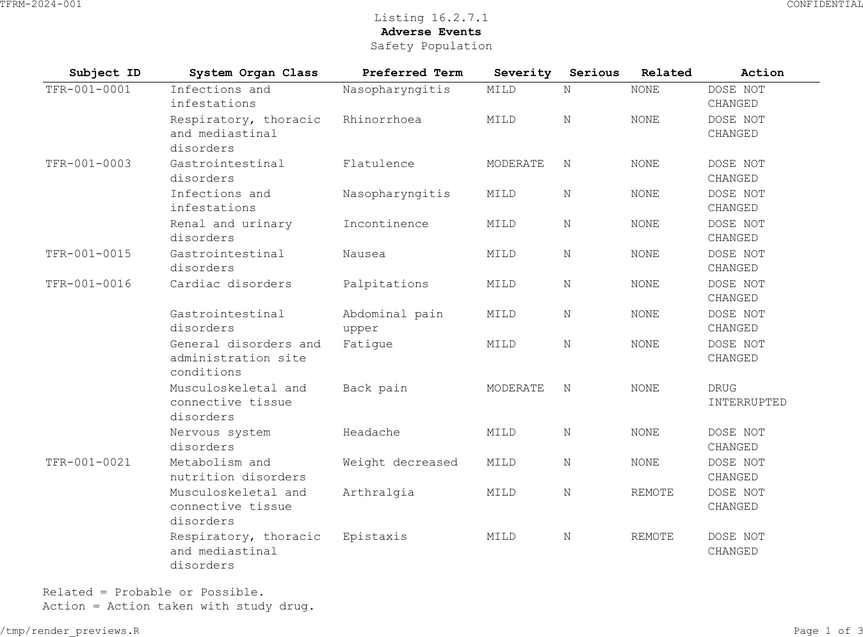
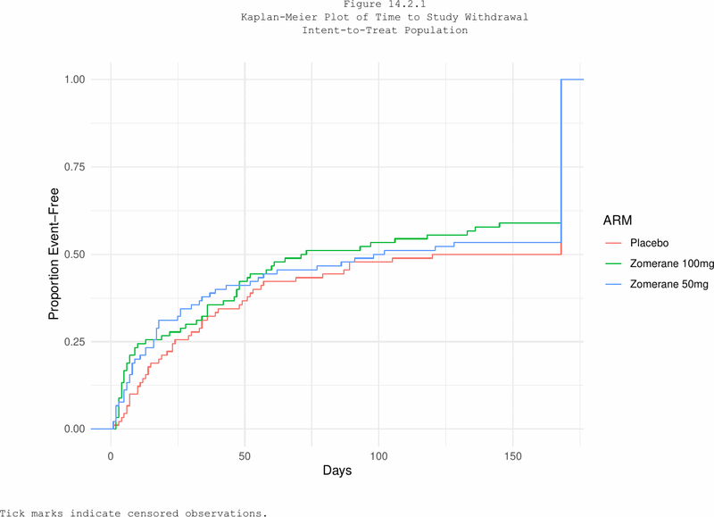

```{r setup, include = FALSE}
knitr::opts_chunk$set(collapse = TRUE, comment = "#>")
library(tlframe)
```

## Listings

`fr_listing()` creates a spec optimised for record-level patient listings.
It uses the same pipeline verbs as `fr_table()` but with different defaults:

| Feature | `fr_table()` | `fr_listing()` |
|---------|-------------|----------------|
| Font size | 9pt | 8pt |
| Alignment | Auto-detect | Left |
| Text wrapping | Off | On |
| Column splitting | Off | On |
| H-lines | None | `"header"` |

### AE Listing (16.2.7.1)

```{r ae-listing}
ae_list <- adae[1:40, c("USUBJID", "AEBODSYS", "AEDECOD",
                         "AESEV", "AESER", "AEREL", "AEACN")]
ae_listing_spec <- ae_list |>
  fr_listing() |>
  fr_titles(
    "Listing 16.2.7.1",
    list("Adverse Events", bold = TRUE),
    "Safety Population"
  ) |>
  fr_cols(
    USUBJID  = fr_col("Subject ID", width = 1.3),
    AEBODSYS = fr_col("System Organ Class", width = 1.8),
    AEDECOD  = fr_col("Preferred Term", width = 1.5),
    AESEV    = fr_col("Severity", width = 0.8),
    AESER    = fr_col("Serious", width = 0.7),
    AEREL    = fr_col("Related", width = 0.8),
    AEACN    = fr_col("Action", width = 1.2)
  ) |>
  fr_rows(sort_by = c("USUBJID", "AEBODSYS", "AEDECOD"),
          repeat_cols = "USUBJID") |>
  fr_footnotes(
    "Related = Probable or Possible.",
    "Action = Action taken with study drug."
  )
fr_validate(ae_listing_spec)
```

```{r ae-listing-render, eval = FALSE}
ae_listing_spec |> fr_render("output/Listing_16_2_7_1.rtf")
```

```{r ae-listing-preview, echo = FALSE, out.width = "100%", fig.cap = "AE listing (PDF output, page 1)"}

```

### Key listing features

**`sort_by`** orders rows by the named columns:

```{r sort-demo}
spec <- adae[1:10, c("USUBJID", "AEDECOD", "AESEV")] |>
  fr_listing() |>
  fr_rows(sort_by = c("USUBJID", "AEDECOD"))
```

**`repeat_cols`** suppresses repeated values (like SAS `NOREPEAT`):

```{r repeat-demo}
spec <- adae[1:10, c("ARM", "USUBJID", "AEDECOD")] |>
  fr_listing() |>
  fr_rows(sort_by = c("ARM", "USUBJID"),
          repeat_cols = c("ARM", "USUBJID"))
```

**`wrap = TRUE`** enables automatic text wrapping (on by default in
listings):

```{r wrap-demo}
spec <- adae[1:5, c("USUBJID", "AEBODSYS")] |>
  fr_listing() |>
  fr_rows(wrap = TRUE)
```

## Figures

`fr_figure()` wraps a ggplot2 or base R plot into the same pipeline,
giving it titles, footnotes, page headers, and footers:

```{r figure-basic, eval = FALSE}
# fr_figure() wraps a ggplot2 or base R plot
# pagehead/pagefoot are inherited from fr_theme() --- no need to repeat
my_plot |>
  fr_figure(width = 8, height = 5) |>
  fr_titles(
    "Figure 14.2.1",
    "Kaplan-Meier Plot of Time to Study Withdrawal"
  )
```

### With ggplot2

```{r figure-ggplot}
if (requireNamespace("ggplot2", quietly = TRUE)) {
  library(ggplot2)
  km_plot <- ggplot(adtte, aes(x = AVAL, colour = ARM)) +
    stat_ecdf(geom = "step") +
    labs(x = "Days", y = "Proportion Event-Free") +
    theme_minimal()

  fig_spec <- km_plot |>
    fr_figure(width = 8, height = 5) |>
    fr_titles(
      "Figure 14.2.1",
      "Kaplan-Meier Plot of Time to Study Withdrawal",
      "Intent-to-Treat Population"
    ) |>
    fr_footnotes("Tick marks indicate censored observations.")
}
```

```{r figure-render, eval = FALSE}
fig_spec |> fr_render("output/Figure_14_2_1.pdf")
```

```{r figure-preview, echo = FALSE, out.width = "100%", fig.cap = "KM figure with titles and footnotes (PDF output)"}

```

### Multi-page figures

Pass a list of plots to create a multi-page figure. Add a `meta` data frame
to inject per-page tokens into titles and footnotes:

```{r multi-page-figure, eval = FALSE}
# Three KM plots --- one per subgroup
km_plots <- list(p_adults, p_pediatrics, p_geriatrics)
page_meta <- data.frame(
  subgroup = c("Adults", "Pediatrics", "Geriatrics"),
  n        = c(80, 55, 30)
)

km_plots |>
  fr_figure(meta = page_meta) |>
  fr_titles(
    "Figure 14.1.1 Kaplan-Meier Curve",
    "Subgroup: {subgroup} (N = {n})"
  ) |>
  fr_footnotes("Source: ADTTE") |>
  fr_render("km_by_subgroup.rtf")
```

Each `meta` column name becomes a `{token}` resolved dynamically per page.
The second title line renders as "Subgroup: Adults (N = 80)" on page 1,
"Subgroup: Pediatrics (N = 55)" on page 2, and so on.

### Figure parameters

| Parameter | Default | Description |
|-----------|---------|-------------|
| `plot` | (required) | ggplot2 object, recorded base R plot, or a list of either |
| `width` | `NULL` | Plot width in inches (auto-sized from page if `NULL`) |
| `height` | `NULL` | Plot height in inches (70% of printable height if `NULL`) |
| `meta` | `NULL` | Data frame with one row per plot; columns become `{token}` names in titles/footnotes |
