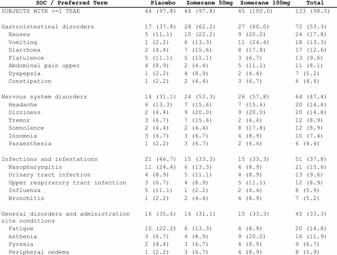
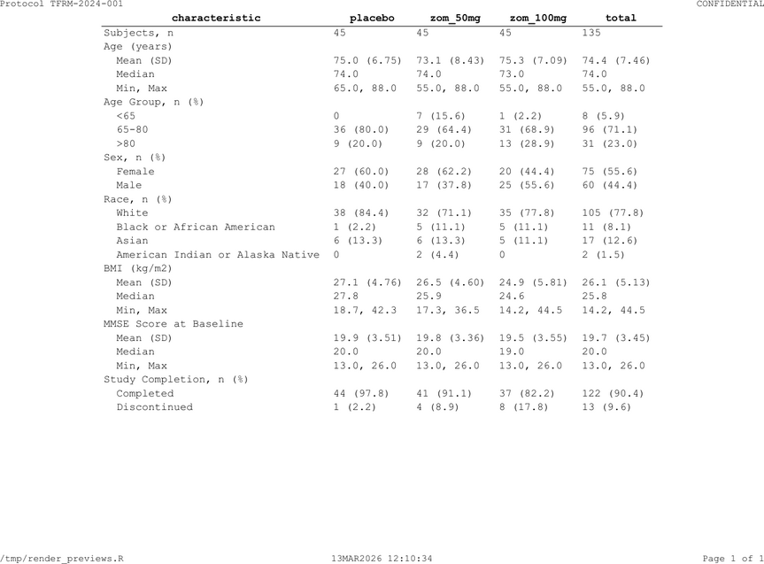

```{r setup, include = FALSE}
knitr::opts_chunk$set(collapse = TRUE, comment = "#>")
library(tlframe)
```

`fr_rows()` controls how data flows across pages. `fr_page()`,
`fr_pagehead()`, and `fr_pagefoot()` control the physical page.

## `page_by`: separate pages per parameter

```{r pageby}
vs_wk24 <- tbl_vs[tbl_vs$timepoint == "Week 24",
                   c("param", "statistic", "placebo_value",
                     "zom_50mg_value", "zom_100mg_value")]
spec <- vs_wk24 |>
  fr_table() |>
  fr_cols(param = fr_col(visible = FALSE)) |>
  fr_rows(page_by = "param", page_by_bold = TRUE)
```

Each unique value of `param` gets its own page section. The label appears
as a bold header above each section.

> **SAS:** `BY param;` in PROC REPORT with `#BYVAL` in titles.

## `group_by` and `blank_after`

```{r groupby}
spec <- tbl_demog |>
  fr_table() |>
  fr_cols(group = fr_col(visible = FALSE)) |>
  fr_rows(group_by = "group", blank_after = "group")
```

`group_by` keeps groups together during pagination. `blank_after` inserts
an empty row after each group.

**Note:** `group_by` auto-implies `blank_after` on the same column, so
you usually only need `group_by`:

```{r groupby-auto}
spec <- tbl_demog |>
  fr_table() |>
  fr_cols(group = fr_col(visible = FALSE)) |>
  fr_rows(group_by = "group")
```

## `indent_by`: SOC/PT hierarchies

```{r indent}
spec <- tbl_ae_soc |>
  fr_table() |>
  fr_cols(
    soc      = fr_col(visible = FALSE),
    pt       = fr_col("SOC / Preferred Term", width = 3.0),
    row_type = fr_col(visible = FALSE)
  ) |>
  fr_rows(group_by = "soc", indent_by = "pt")
```

```{r indent-preview, echo = FALSE, out.width = "100%", fig.cap = "SOC/PT hierarchy with indentation"}

```

`indent_by` indents the named column's values by 2 characters beneath the
group header. SOC terms appear flush-left; PTs are indented.

### Multi-level indent

For deeper hierarchies (SOC / HLT / PT), pass a named list with a key
column that determines indent level per row:

```{r indent-multi}
ae_hierarchy <- data.frame(
  soc      = rep("Gastrointestinal disorders", 5),
  term     = c("Gastrointestinal disorders", "GI signs and symptoms",
               "Nausea", "Vomiting", "Diarrhoea"),
  row_type = c("soc", "hlt", "pt", "pt", "pt"),
  total    = c("72 (53.3)", "54 (40.0)", "24 (17.8)", "18 (13.3)", "12 (8.9)"),
  stringsAsFactors = FALSE
)

spec <- ae_hierarchy |>
  fr_table() |>
  fr_cols(
    soc      = fr_col(visible = FALSE),
    row_type = fr_col(visible = FALSE),
    term     = fr_col("SOC / HLT / Preferred Term", width = 3.5),
    total    = fr_col("Total\nn (%)")
  ) |>
  fr_rows(
    group_by  = "soc",
    indent_by = list(
      key    = "row_type",
      col    = "term",
      levels = c(soc = 0, hlt = 1, pt = 2)
    )
  )
```

Each level adds 2 space-character widths (~0.17 in at 9pt). SOC rows get
0 indent, HLT rows get 1 level, PT rows get 2 levels.

## `group_label`: auto-inject group headers

When group names and display values live in **separate columns** (e.g.,
demographics where `"Sex"` is the group and `"Male"` / `"Female"` are the
statistics), `group_label` auto-injects the group value as a header row
in the target display column:

```{r group-label}
demog_long <- data.frame(
  variable = c("Sex", "Sex", "Age (years)", "Age (years)", "Age (years)"),
  stat     = c("Female", "Male", "Mean (SD)", "Median", "Min, Max"),
  value    = c("27 (60.0)", "18 (40.0)", "75.0 (6.8)", "74.0", "65, 88"),
  stringsAsFactors = FALSE
)

spec <- demog_long |>
  fr_table() |>
  fr_cols(variable = fr_col(visible = FALSE)) |>
  fr_rows(
    group_by    = "variable",
    group_label = "stat",
    indent_by   = "stat"
  )
```

This inserts `"Sex"` and `"Age (years)"` as header rows in the `stat`
column at each group boundary. Detail rows (`"Female"`, `"Male"`, etc.)
are indented underneath. Style the injected headers via `fr_styles()`
if you want bold or background color.

## `group_keep`: visual-only grouping

By default, `group_by` keeps groups together on the same page. Set
`group_keep = FALSE` for visual-only grouping (blank-after spacing,
indent) without page-keeping — useful for long groups where you want the
renderer to break freely:

```{r group-keep}
spec <- tbl_demog |>
  fr_table() |>
  fr_cols(group = fr_col(visible = FALSE)) |>
  fr_rows(group_by = "group", group_keep = FALSE)
```

## `wrap`: text wrapping in body cells

For listings with long text fields, set `wrap = TRUE` to enable text
wrapping in body cells. Without wrapping, long values overflow the cell
boundary; with it, the cell grows vertically to fit:

```{r wrap, eval = FALSE}
adae[1:10, c("USUBJID", "AEBODSYS", "AEDECOD", "AEOUT")] |>
  fr_table() |>
  fr_rows(wrap = TRUE)
```

`wrap` pairs naturally with `repeat_cols` on listings where the first
column (e.g., subject ID) should appear only once per block:

```{r wrap-repeat, eval = FALSE}
adae[1:30, c("USUBJID", "AEBODSYS", "AEDECOD", "AESEV", "ASTDT")] |>
  fr_table() |>
  fr_rows(
    sort_by     = c("USUBJID", "AEBODSYS", "AEDECOD"),
    repeat_cols = c("USUBJID", "AEBODSYS"),
    wrap        = TRUE
  )
```

## `page_by_visible`: hidden page breaks

Set `page_by_visible = FALSE` to get page breaks at group boundaries
without a visible label above the headers:

```{r pageby-hidden}
spec <- tbl_ae_soc |>
  fr_table() |>
  fr_cols(soc = fr_col(visible = FALSE),
          row_type = fr_col(visible = FALSE)) |>
  fr_rows(page_by = "soc", page_by_visible = FALSE)
```

## Combining row features

```{r rows-combined}
spec <- tbl_ae_soc |>
  fr_table() |>
  fr_cols(
    soc      = fr_col(visible = FALSE),
    pt       = fr_col("SOC / PT", width = 3.0),
    row_type = fr_col(visible = FALSE),
    placebo  = fr_col("Placebo"),
    zom_50mg = fr_col("Zomerane 50mg"),
    zom_100mg = fr_col("Zomerane 100mg"),
    total    = fr_col("Total")
  ) |>
  fr_rows(group_by = "soc", indent_by = "pt")
```

## `sort_by` and `repeat_cols`

For listings, `sort_by` controls row order and `repeat_cols` suppresses
repeated values:

```{r sort-repeat}
ae_list <- adae[1:20, c("USUBJID", "ARM", "AEDECOD", "AESEV")]
spec <- ae_list |>
  fr_listing() |>
  fr_rows(sort_by = c("ARM", "USUBJID"),
          repeat_cols = "ARM")
```

`repeat_cols` only prints the value when it changes (like `NOREPEAT` in SAS).

## Page configuration

```{r page}
spec <- tbl_demog |>
  fr_table() |>
  fr_page(
    orientation = "landscape",
    paper       = "letter",
    font_family = "Courier New",
    font_size   = 9,
    margins     = c(top = 1.0, right = 0.75, bottom = 1.0, left = 0.75)
  )
pg <- fr_get_page(spec)
pg$orientation
```

These are the package defaults --- you only need `fr_page()` when overriding.

### Orphan and widow control

`orphan_min` and `widow_min` prevent isolated rows at page boundaries.
`orphan_min` (default `3L`) is the minimum number of body rows that must
remain at the bottom of a page before a group; if fewer would remain,
the entire group moves to the next page. `widow_min` (default `3L`) is
the minimum number of rows that must carry over to the top of the next
page:

```{r orphan-widow}
spec <- tbl_ae_soc |>
  fr_table() |>
  fr_rows(group_by = "soc") |>
  fr_page(orphan_min = 2L, widow_min = 2L)
```

Set either to `1L` to disable the corresponding control. These settings
only take effect when `group_by` is active.

> **Custom fonts for PDF:** Set `TLFRAME_FONT_DIR` to a directory of `.ttf`/`.otf`
> files and XeLaTeX discovers them by name --- no system-wide installation needed.
> See `vignette("automation")` for Docker/CI examples.

### Margin formats

| Format | Meaning |
|--------|---------|
| `margins = 1.0` | All four margins = 1 inch |
| `margins = c(1.0, 0.75)` | Top/bottom = 1, left/right = 0.75 |
| `margins = c(1.0, 0.75, 1.0, 0.75)` | Top, right, bottom, left |
| `margins = list(top = 1, ...)` | Named list |

## Running headers and footers

```{r pagehead}
spec <- tbl_demog |>
  fr_table() |>
  fr_pagehead(
    left  = "Protocol TFRM-2024-001",
    right = "CONFIDENTIAL"
  ) |>
  fr_pagefoot(
    left   = "{program}",
    center = "{datetime}",
    right  = "Page {thepage} of {total_pages}"
  )
```

```{r pagehead-preview, echo = FALSE, out.width = "100%", fig.cap = "Running headers and footers with protocol ID and page numbers"}

```

### Built-in tokens

| Token | Value |
|-------|-------|
| `{thepage}` | Current page number |
| `{total_pages}` | Total page count |
| `{program}` | Source file name |
| `{datetime}` | Render timestamp |

### Custom tokens

```{r tokens}
spec <- tbl_demog |>
  fr_table() |>
  fr_page(tokens = list(study = "TFRM-2024-001", cutoff = "15MAR2025")) |>
  fr_pagefoot(left = "Study: {study}", right = "Cutoff: {cutoff}")
```

> **SAS:** `TITLE j=l "Protocol..." j=r "CONFIDENTIAL";` and
> `FOOTNOTE j=l "&_SASPROGRAMFILE" j=r "Page ^{thispage} of ^{lastpage}";`

## ICH E3 compliance mapping

| ICH E3 Requirement | tlframe Feature |
|--------------------|-----------------|
| Study ID on every page | `fr_pagehead(left = "Study TFRM-2024-001")` |
| Table number and title | `fr_titles("Table 14.1.1", "Demographics...")` |
| Population label | Third title line |
| Treatment arm N-counts | `fr_cols(.n = ..., .n_format = ...)` |
| Page numbering | `fr_pagefoot(right = "Page {thepage} of {total_pages}")` |
| Program name | `fr_pagefoot(left = "{program}")` |
| Continuation label | `fr_page(continuation = "(continued)")` |
| Footnotes/abbreviations | `fr_footnotes(...)` |

## Continuation text

For multi-page tables, `continuation` appends text to titles on page 2+:

```{r continuation}
spec <- tbl_ae_soc |>
  fr_table() |>
  fr_titles("Table 14.3.1", "TEAEs by SOC and Preferred Term") |>
  fr_page(continuation = "(continued)")
```

## Section spacing

`fr_spacing()` controls blank lines between structural sections:

```{r spacing}
spec <- tbl_demog |>
  fr_table() |>
  fr_spacing(
    titles_after     = 1,
    footnotes_before = 1,
    pagehead_after   = 0,
    pagefoot_before  = 0,
    page_by_after    = 1
  )
```
