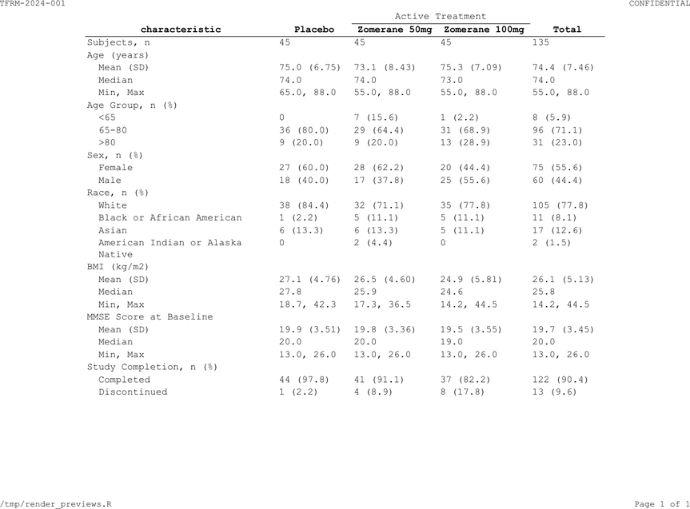
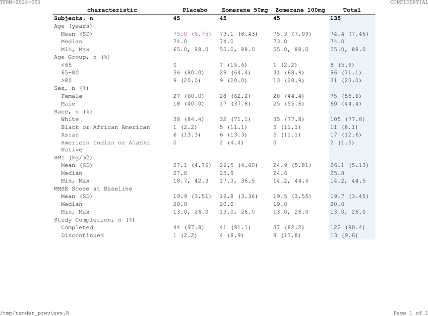
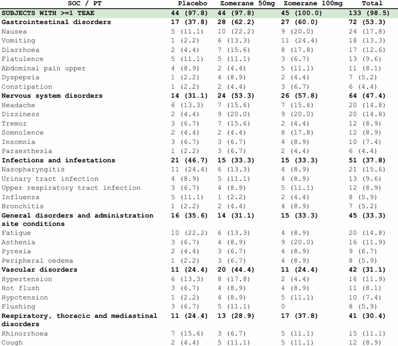
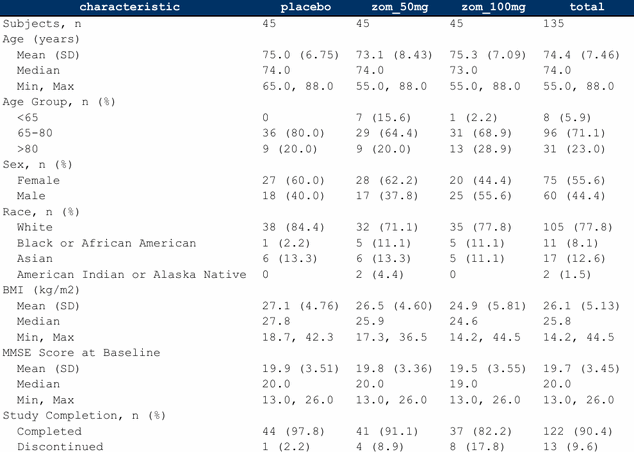
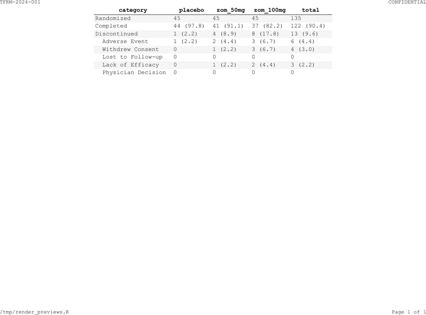

```{r setup, include = FALSE}
knitr::opts_chunk$set(collapse = TRUE, comment = "#>")
library(tlframe)
```

## Horizontal rules

```{r hlines}
spec <- tbl_demog |>
  fr_table() |>
  fr_hlines("header")
```

### Presets

| Preset | Description |
|--------|-------------|
| `"header"` | Single rule below the column header only (pharma standard, ICH E3) |
| `"open"` | Rule above header + rule below header; no bottom border |
| `"hsides"` | Rule at the top (above header) and bottom (below body) only |
| `"above"` | Single rule above the column header only |
| `"below"` | Single rule below the last body row only |
| `"booktabs"` | Thick top (1pt) + thin mid (0.5pt) + thick bottom (1pt) (publication style) |
| `"box"` | Full outer border on all four sides |
| `"void"` | No horizontal rules; clears all previously set rules |

### Custom styling

```{r hlines-custom}
spec <- tbl_demog |>
  fr_table() |>
  fr_hlines("open", width = "thick", color = "#003366", linestyle = "dashed")
```

Width options: `"hairline"` (0.25pt), `"thin"` (0.5pt), `"medium"` (1pt),
`"thick"` (1.5pt), or a numeric value in points.

> **SAS:** `STYLE(header)=[borderbottomstyle=solid borderbottomwidth=1pt];`

## Vertical rules and grids

```{r vlines}
spec <- tbl_demog |>
  fr_table() |>
  fr_hlines("header") |>
  fr_vlines("inner")
```

Vertical presets: `"box"` (outer edges only), `"all"` (every column + outer), `"inner"` (between columns only), `"void"` (none).

`fr_grid()` is shorthand for combined horizontal + vertical rules:

```{r grid}
spec <- tbl_demog |>
  fr_table() |>
  fr_grid("box/all", width = "thin", color = "#999999")
```

## Spanning headers

`fr_spans()` groups columns under a shared label:

```{r spans-basic}
spec <- tbl_demog |>
  fr_table() |>
  fr_cols(
    characteristic = fr_col("", width = 2.5),
    placebo   = fr_col("Placebo"),
    zom_50mg  = fr_col("Zomerane 50mg"),
    zom_100mg = fr_col("Zomerane 100mg"),
    total     = fr_col("Total"),
    group     = fr_col(visible = FALSE)
  ) |>
  fr_spans("Active Treatment" = c("zom_50mg", "zom_100mg"))
```

```{r spans-preview, echo = FALSE, out.width = "100%", fig.cap = "Spanning header grouping treatment columns"}

```

Unlike most verbs, `fr_spans()` **appends** on repeated calls.

### Multi-level spans

Build from inner to outer (lowest level first):

```{r spans-multi, eval = FALSE}
spec |>
  fr_spans("10 mg"  = c("low_n", "low_pct"),  .level = 1) |>
  fr_spans("25 mg"  = c("high_n", "high_pct"), .level = 1) |>
  fr_spans("Zomerane" = c("low_n", "low_pct",
                           "high_n", "high_pct"), .level = 2)
```

Level 1 sits above column labels; level 2 sits above level 1.

### Tidyselect spans

```{r spans-tidy}
spec <- tbl_demog |>
  fr_table() |>
  fr_spans("Zomerane" = starts_with("zom_"))
```

### Gap columns

By default, a narrow gap separates adjacent spans at the same level.
Disable with `.gap = FALSE`:

```{r spans-gap}
spec <- tbl_demog |>
  fr_table() |>
  fr_spans(
    "Zomerane" = c("zom_50mg", "zom_100mg"),
    "Reference" = "placebo",
    .gap = FALSE
  )
```

## Cell styling

Apply visual overrides to rows, columns, or individual cells:

```{r styles-basic}
spec <- tbl_demog |>
  fr_table() |>
  fr_cols(
    characteristic = fr_col("", width = 2.5),
    placebo   = fr_col("Placebo"),
    zom_50mg  = fr_col("Zomerane 50mg"),
    zom_100mg = fr_col("Zomerane 100mg"),
    total     = fr_col("Total"),
    group     = fr_col(visible = FALSE)
  ) |>
  fr_hlines("header") |>
  fr_styles(
    fr_row_style(rows = 1, bold = TRUE),
    fr_col_style(cols = "total", bg = "#EBF5FB"),
    fr_style(rows = 3, cols = "placebo", fg = "#CC0000")
  )
```

```{r styles-preview, echo = FALSE, out.width = "100%", fig.cap = "Row bold + column background + cell foreground color"}

```

### Style constructors

| Constructor | Scope | Key args |
|------------|-------|----------|
| `fr_row_style()` | Entire row(s) | `rows`, `bold`, `bg`, `fg`, `align`, `valign`, `height`, ... |
| `fr_col_style()` | Entire column(s) | `cols`, `bold`, `bg`, `fg`, `align`, `valign`, ... |
| `fr_style()` | Row-column intersection | `region`, `rows`, `cols`, `bold`, `bg`, `fg`, `align`, `valign`, `colspan`, ... |
| `fr_style_if()` | Data-driven (conditional) | `condition`, `cols`, `apply_to`, `bold`, `bg`, `fg`, `align`, ... |

`fr_style()` targets a specific `region`: `"body"` (default), `"header"`, or `"stub"`.
`valign` controls vertical placement within the cell: `"top"`, `"middle"`, or `"bottom"`.

Like `fr_spans()`, `fr_styles()` **appends** on repeated calls.

### Content-based row selection

`fr_rows_matches()` selects rows by data values instead of row numbers:

```{r rows-matches}
spec <- tbl_ae_soc |>
  fr_table() |>
  fr_cols(
    soc      = fr_col(visible = FALSE),
    pt       = fr_col("SOC / PT", width = 3.0),
    row_type = fr_col(visible = FALSE),
    placebo  = fr_col("Placebo"),
    zom_50mg = fr_col("Zomerane 50mg"),
    zom_100mg = fr_col("Zomerane 100mg"),
    total    = fr_col("Total")
  ) |>
  fr_styles(
    fr_row_style(
      rows = fr_rows_matches("row_type", value = "soc"), bold = TRUE
    ),
    fr_row_style(
      rows = fr_rows_matches("row_type", value = "total"),
      bold = TRUE, bg = "#D5E8D4"
    )
  )
```

```{r rows-matches-preview, echo = FALSE, out.width = "100%", fig.cap = "Content-based styling: SOC rows bold, total row highlighted"}

```

Regex patterns work too:

```{r rows-regex}
spec <- tbl_tte |>
  fr_table() |>
  fr_styles(
    fr_row_style(
      rows = fr_rows_matches("statistic", pattern = "^[A-Z]"),
      bold = TRUE
    )
  )
```

### Header region styling

```{r header-region}
spec <- tbl_demog |>
  fr_table() |>
  fr_styles(
    fr_style(region = "header", bold = TRUE, bg = "#003366",
             fg = "#FFFFFF", align = "center")
  )
```

```{r header-region-preview, echo = FALSE, out.width = "100%", fig.cap = "Dark navy header with white text"}

```

### Zebra striping

```{r zebra}
spec <- tbl_disp |>
  fr_table() |>
  fr_styles(
    fr_row_style(rows = seq(1, nrow(tbl_disp), 2), bg = "#F5F5F5")
  )
```

```{r zebra-preview, echo = FALSE, out.width = "100%", fig.cap = "Alternating row backgrounds (zebra striping)"}

```

### Conditional styling with `fr_style_if()`

`fr_style_if()` applies styles based on cell values rather than row numbers.
The condition is a one-sided formula using `.x` as the pronoun, or a plain
function. It is evaluated at render time against the actual data, so it works
correctly even when row positions are unknown in advance.

**Bold "Total" rows** — match exact text in a column:

```{r style-if-total}
spec <- tbl_demog |>
  fr_table() |>
  fr_hlines("header") |>
  fr_styles(
    fr_style_if(
      cols = "characteristic",
      condition = ~ .x == "Total",
      apply_to = "row",
      bold = TRUE, bg = "#E8E8E8"
    )
  )
```

**Zebra striping without hard-coded indices** — when `cols = NULL`, `.x`
receives row indices:

```{r style-if-zebra}
spec <- tbl_disp |>
  fr_table() |>
  fr_hlines("header") |>
  fr_styles(
    fr_style_if(
      condition = ~ (.x %% 2) == 0,
      apply_to = "row",
      bg = "#F5F5F5"
    )
  )
```

**Highlight significant p-values** — numeric comparison on a character column:

```{r style-if-pvalue}
pval_data <- data.frame(
  characteristic = c("Age", "Sex", "Weight"),
  treatment = c("50 (23.5)", "30 (14.1)", "45 (21.1)"),
  placebo   = c("55 (25.8)", "28 (13.1)", "52 (24.4)"),
  pvalue    = c("0.042", "0.310", "0.003"),
  stringsAsFactors = FALSE
)

spec <- pval_data |>
  fr_table() |>
  fr_hlines("header") |>
  fr_styles(
    fr_style_if(
      cols = "pvalue",
      condition = ~ as.numeric(.x) < 0.05,
      apply_to = "row",
      bold = TRUE, fg = "#CC0000"
    )
  )
```

**Colour only the matching cells** — use `apply_to = "cell"` (the default)
instead of `"row"`:

```{r style-if-cell}
spec <- tbl_ae_soc |>
  fr_table() |>
  fr_hlines("header") |>
  fr_styles(
    fr_style_if(
      cols = "soc",
      condition = ~ grepl("SKIN|GASTROINTESTINAL", .x, ignore.case = TRUE),
      apply_to = "row",
      bg = "#FFF3CD"
    )
  )
```

The `condition` argument also accepts a plain function instead of a formula:

```{r style-if-fn, eval = FALSE}
is_total <- function(x) x == "Total"

tbl_demog |>
  fr_table() |>
  fr_styles(
    fr_style_if(
      cols = "characteristic",
      condition = is_total,
      apply_to = "row",
      bold = TRUE, bg = "#E8E8E8"
    )
  )
```

> **SAS:** `COMPUTE characteristic; IF characteristic = "Total" THEN CALL DEFINE(_ROW_, "STYLE", "STYLE=[FONT_WEIGHT=BOLD BACKGROUND=GRAY]"); ENDCOMP;`

`fr_style_if()` objects are passed to `fr_styles()` alongside `fr_row_style()`,
`fr_col_style()`, and `fr_style()`. All four constructor types can be mixed in
a single `fr_styles()` call.

### Style precedence

When multiple styles target the same cell, later styles win. Order from
broadest to most specific:

```{r precedence}
spec <- tbl_demog |>
  fr_table() |>
  fr_cols(group = fr_col(visible = FALSE)) |>
  fr_styles(
    fr_col_style(cols = "total", bg = "#F0F4F8"),       # broadest
    fr_row_style(rows = 1, bold = TRUE),                # narrower
    fr_style(rows = 1, cols = "total",
             bg = "#003366", fg = "#FFFFFF")             # most specific
  )
```

### Style debugging

`fr_style_explain()` shows the resolution chain for a specific cell:

```{r style-explain}
spec <- tbl_demog |>
  fr_table() |>
  fr_styles(
    fr_row_style(rows = 1, bold = TRUE),
    fr_col_style(cols = "total", bg = "#EBF5FB")
  )
fr_style_explain(spec, row = 1, col = "total")
```
